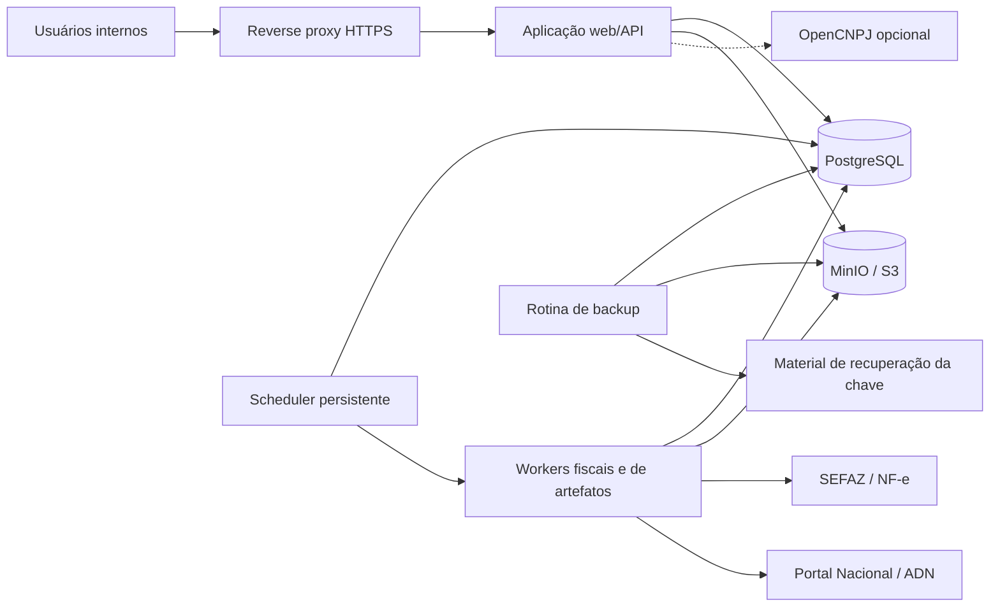
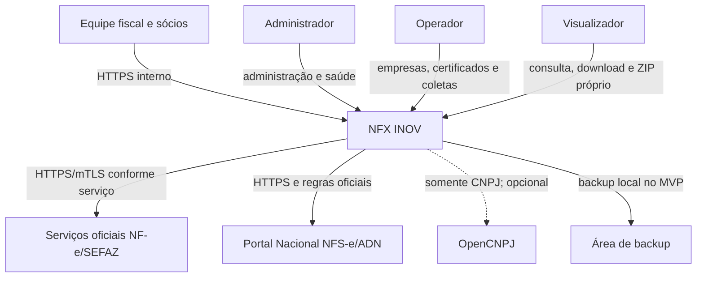
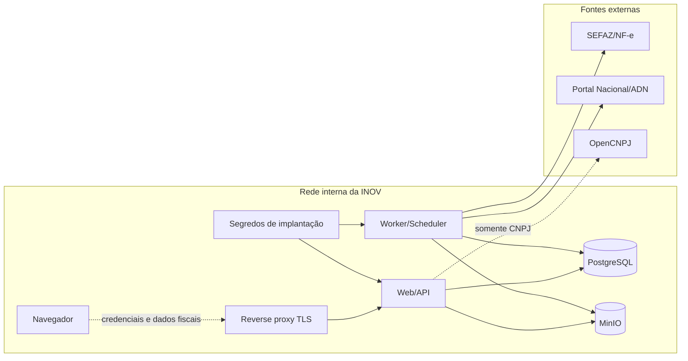
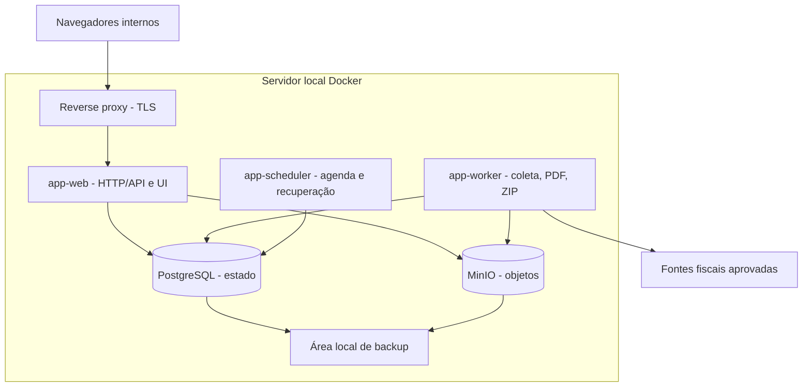
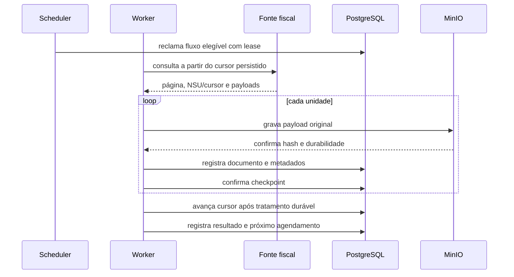
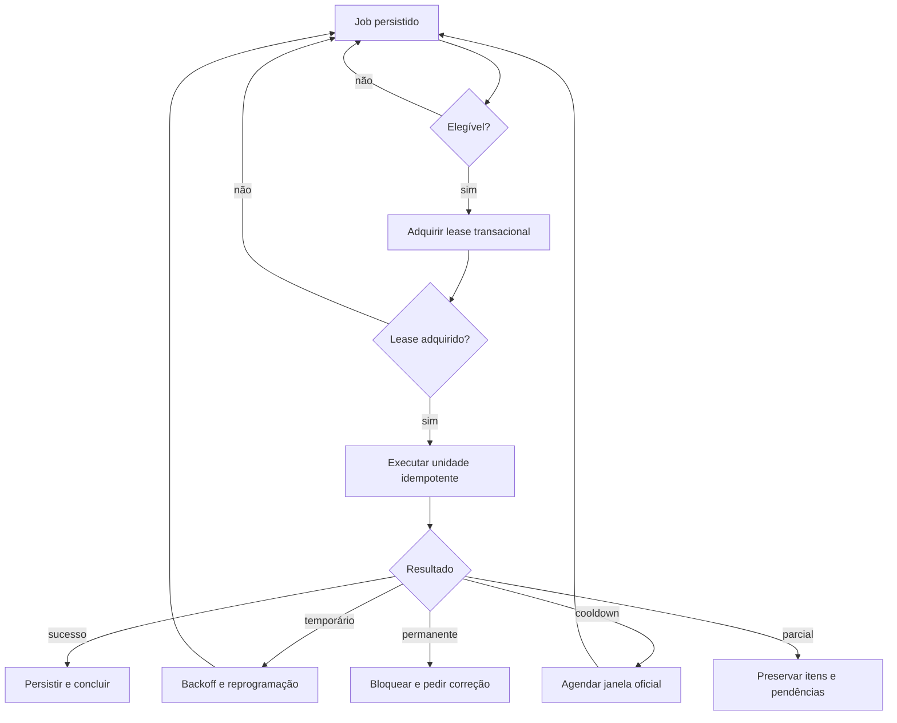
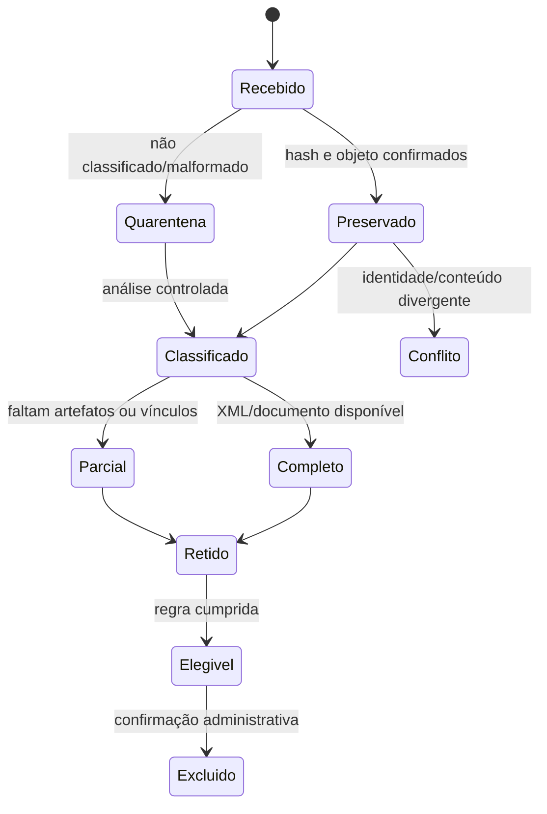

# Arquitetura técnica — NFX INOV

## 1. Controle do documento e status

| Campo | Valor |
|---|---|
| Produto | NFX INOV |
| Organização | INOV Contabilidade |
| Documento | Arquitetura técnica |
| Relacionamento | Complementa o `PRD.md`; não o substitui |
| Status | Proposta arquitetural aprovada para detalhamento técnico |
| Versão | 1.1 |
| Idioma | Português brasileiro |
| Fuso de apresentação | America/Sao_Paulo |
| Escala | Aproximadamente 200 empresas |
| Fonte | `PRD.md`, versão 1.0 — MVP |
| Data | 2026-08-10 |

Este documento define responsabilidades, limites, invariantes, tecnologias, persistência, operação e decisões arquiteturais. Não define o esquema físico final do banco, SQL, migrações, contratos completos de API, diretórios de código, tarefas ou sequência de implementação.

## 2. Escopo e relação com o PRD

O NFX INOV é uma aplicação web interna para cadastrar empresas e certificados A1, coletar NF-e e NFS-e disponibilizadas por fontes oficiais, preservar documentos e eventos, gerar artefatos derivados, consultar o acervo, exportar ZIPs, auditar ações, aplicar retenção e operar backups.

O PRD é a autoridade para comportamento do produto, papéis, cobertura, retenção e critérios de aceite. Esta arquitetura traduz esses requisitos em responsabilidades técnicas. Quando há uma limitação operacional assumida neste documento, ela é marcada como exceção e não como alteração do PRD.

Não fazem parte desta arquitetura os não objetivos do PRD: portal externo, SaaS, mobile, integrações contábeis, migração legada, upload manual, notificações, 2FA, recuperação por e-mail, Excel/CSV, relatórios especializados, filtro por valor, exclusão automática, segregação por carteira, API pública ou integrações municipais diretas fora do Portal Nacional/ADN.

## 3. Drivers arquiteturais

- Integridade fiscal e ausência de perda silenciosa prevalecem sobre throughput máximo.
- Todo progresso fiscal deve ser durável, recuperável e rastreável à fonte e à execução.
- Retrys, replays, reinícios, geração de PDF e exportações devem ser idempotentes.
- NF-e e NFS-e/ADN possuem estados, fontes, identificadores e cursores independentes.
- O payload recebido é original e imutável; XML, PDF e ZIP são tratados com papéis distintos.
- Estados parcial, retry, bloqueado, conflitante, desconhecido, quarentenado e degradado são estados de primeira classe.
- A aplicação deve operar sem usuário conectado, 24 horas por dia.
- Autorização, auditoria, retenção e proteção de certificados são obrigações do servidor.
- A solução deve ser operável por uma equipe pequena e adequada a cerca de 200 empresas.
- A evolução futura deve ser possível sem começar com microserviços ou dependências distribuídas desnecessárias.

## 4. Restrições

- Implantação inicial local com Docker.
- Acesso da aplicação somente pela rede interna da INOV.
- Conectividade de saída restrita a destinos fiscais aprovados e, opcionalmente, OpenCNPJ.
- Interface em português brasileiro; moeda em real; apresentação no horário de Brasília.
- Não existe migração de dados legados.
- NFS-e no MVP limita-se ao Portal Nacional/ADN.
- Regras, limites, NSUs, cooldowns, leiautes e endpoints externos podem mudar e não serão codificados como constantes imutáveis.
- O PRD exige cópias separadas do servidor primário, mas o deployment MVP aprovado assume backups locais na mesma máquina. Esta é uma exceção operacional explícita, detalhada em Backup e Riscos.
- HTTPS é obrigatório; o MVP utilizará certificado autoassinado local, com risco de confiança do navegador explicitamente aceito.

## 5. Atributos de qualidade

| Atributo | Decisão arquitetural |
|---|---|
| Integridade | Identidade fiscal, hashes, unicidade, conflitos explícitos e persistência antes do cursor |
| Durabilidade | PostgreSQL para estado; MinIO para objetos; jobs, leases e cursores persistidos |
| Recuperabilidade | Reprocessamento seguro, jobs retomáveis, backups de banco/objetos/chave e testes |
| Segurança | HTTPS, cookies seguros, Argon2id, autorização server-side e criptografia de certificados |
| Auditabilidade | Eventos append-only com ator, ação, resultado, motivo, alvo e integridade verificável |
| Operabilidade | Monólito modular, poucos serviços, health checks, métricas e dashboard administrativo |
| Evolução | Adaptadores fiscais e módulos de domínio isolados |
| Escala | Capacidade suficiente para 200 empresas, com paralelismo limitado por fonte e empresa |
| Clareza | Estados explícitos para vazio, parcial, bloqueio, conflito, quarentena e degradação |

## 6. Visão geral da arquitetura

Adotar um monólito modular com uma aplicação web e processos assíncronos que usam a mesma base de domínio. A separação em processos impede que uma coleta, renderização ou exportação bloqueie requisições web, sem introduzir a complexidade de serviços independentes.



A aplicação web não é a autoridade de jobs nem de objetos: ela solicita operações e consulta estados persistidos. O scheduler agenda ou reclama jobs; o worker executa unidades de trabalho com lease e idempotência.

## 7. Contexto do sistema



A rede interna reduz exposição, mas não substitui autenticação, autorização, proteção de sessão, validação de destino ou HTTPS. Nenhuma interface externa da aplicação é prevista.

## 8. Limites de confiança



As fronteiras principais são navegador/rede, proxy/aplicação, aplicação/infraestrutura de dados, worker/fontes fiscais e implantação/segredos. Respostas externas são não confiáveis até validação, preservação e classificação.

## 9. Visão de containers e deployment



Web, worker e scheduler usam a mesma versão da aplicação, mas têm comandos e limites de recurso distintos. PostgreSQL e MinIO não são expostos aos usuários. O console administrativo do MinIO não é interface operacional do produto.

O Docker atual, com PostgreSQL, MinIO e agente de desenvolvimento, é apenas base inicial. A topologia de runtime acima é a direção arquitetural; sua configuração física futura não é definida por este documento.

## 10. Arquitetura de componentes

### 10.1 Módulos de domínio

- **Identidade e acesso**: usuários, papéis, credenciais, sessões, revogação e autorização.
- **Empresas**: CNPJ, razão social, ciclo de vida, cobertura, enriquecimento e habilitação de fluxos.
- **Certificados**: certificado corrente por empresa, validação, cifragem, vencimento e substituição.
- **Coleta**: execuções, estados por empresa/fluxo/fonte, políticas, cursores, unidades e manifestação.
- **Documentos fiscais**: identidade, classificação, competência, situação, relacionamentos e conflitos.
- **Artefatos**: payload original, XML, PDF, hashes, versões de renderer e quarentena.
- **Exportações**: filtros congelados, seleção, ZIP, completude, expiração e download.
- **Retenção**: elegibilidade, bloqueios, confirmação, exclusão coerente e auditoria.
- **Auditoria**: eventos append-only, integridade e consulta administrativa.
- **Operação**: health checks, métricas, atrasos, backups, limites e políticas externas.

### 10.2 Adaptadores

- **NF-e** encapsula certificado, endpoints, distribuição, manifestação, NSU/cursor, eventos e envelopes.
- **NFS-e/ADN** encapsula distribuição por ator, documentos/eventos, NSU, cobertura e leiautes.
- **OpenCNPJ** é opcional, não autoritativo, envia somente CNPJ e não participa da transação de coleta.
- Nenhum adaptador grava diretamente em estado de outro módulo; usa portas de ingestão do domínio de coleta.

### 10.3 Serviços transversais

- **Armazenamento durável** grava o objeto e retorna hash/metadados verificáveis.
- **Idempotência** calcula chaves por operação e identidade, apoiada por restrições persistentes.
- **Leases** impedem execução concorrente e expiram após falha de processo.
- **Política externa** mantém regras versionadas e efetivas por fonte/fluxo.
- **Redação de erros** remove segredo, stack, XML e detalhes internos indevidos das respostas.

### 10.4 Arquitetura da interface web

O frontend React é organizado por funcionalidades de negócio e preserva os mesmos limites dos
módulos de domínio. O arquivo `src/main.tsx` é somente o ponto de entrada que valida o elemento
raiz e inicializa o React; a composição da aplicação e do shell pertence a `App.tsx`.

- Autenticação, usuários, empresas, certificados, coletas, documentos e auditoria possuem
  módulos de funcionalidade próprios, contendo sua apresentação, estado e contratos TypeScript.
- A comunicação HTTP compartilhada centraliza credenciais same-origin, CSRF, serialização e
  conversão de falhas em erros seguros; funcionalidades não duplicam esse mecanismo.
- Tipos permanecem junto do domínio que os possui. Componentes e utilitários compartilhados
  contêm apenas comportamento realmente transversal e não acumulam regras de negócio.
- Estado local e composição React são o padrão. Router ou biblioteca global de estado somente
  serão introduzidos quando navegação ou compartilhamento de estado demonstrarem essa necessidade.
- A interface pode ocultar ações conforme o papel para melhorar a experiência, mas toda
  autorização continua aplicada pelo servidor; visibilidade no cliente nunca é controle de acesso.
- Refatorações estruturais preservam os contratos HTTP, os identificadores de seção, a
  navegação e os estados visíveis, salvo mudança de produto ou spec aprovada separadamente.

## 11. Organização do repositório

A organização lógica é por contexto de negócio, com infraestrutura compartilhada isolada. Isso explicita propriedade de estado sem criar microserviços.

```text
raiz/
├── identidade e acesso
├── empresas e certificados
├── coleta e fontes fiscais
├── documentos e artefatos
├── exportações e retenção
├── auditoria e operação
├── adaptadores NF-e e NFS-e/ADN
├── infraestrutura PostgreSQL e MinIO
├── interface web/API
├── processos worker/scheduler
└── testes, fixtures e simuladores
```

Os nomes físicos de pacotes serão definidos no desenho de implementação. Módulos não acessam tabelas, objetos ou lógica privada de outro módulo diretamente; usam serviços ou portas internas.

## 12. Stack selecionada e justificativa

**Backend:** Python 3.12 com Django e Django REST Framework. Django oferece autenticação, gestão de sessão, ORM transacional e operação madura para um monólito. DRF separa a interface HTTP dos casos de uso sem criar API pública.

**Frontend:** React com TypeScript. É adequado a filtros, dashboards, progresso de jobs e detalhes fiscais em desktop. O build é servido internamente; não há aplicação mobile.

**Persistência:** PostgreSQL é a autoridade para dados relacionais, restrições, locks, leases, jobs e auditoria. MinIO é armazenamento de objetos compatível com S3 para conteúdo grande. A decisão fiscal não depende de consistência eventual.

**Assíncrono:** Jobs persistentes no PostgreSQL e workers da aplicação. Redis, RabbitMQ e Kafka não são justificados inicialmente: adicionariam estado operacional, backup e recuperação sem necessidade comprovada.

**Proxy:** Reverse proxy local termina HTTPS, restringe origem e caminhos, impõe limites básicos e encaminha apenas à aplicação.

## 13. Alternativas consideradas e rejeitadas

| Alternativa | Decisão | Motivo |
|---|---|---|
| Microserviços | Rejeitada | Complexidade de deploy, observabilidade e transações desproporcional |
| Monólito síncrono | Rejeitado | Coleta, PDF e ZIP bloqueariam a aplicação |
| Node.js como backend | Rejeitado inicialmente | O scaffold suporta Python e Django reduz trabalho de identidade/sessão/administração |
| FastAPI puro | Rejeitado inicialmente | Exigiria compor mais infraestrutura para este monólito relacional |
| SQLite | Rejeitado | Concorrência e recuperação insuficientes |
| Redis obrigatório | Rejeitado | PostgreSQL suporta a fila inicial com maior simplicidade operacional |
| Blobs no PostgreSQL | Rejeitado | Aumenta banco e impacto de backup |
| MinIO como banco fiscal | Rejeitado | Objetos não substituem identidade, relações e restrições |
| Cursor em memória | Rejeitado | Reinício poderia perder progresso |
| Rede interna sem HTTPS | Rejeitada | Rede interna não é fronteira de confiança |
| Backup local como proteção de desastre | Rejeitado como alegação | Não sobrevive à perda do host |

## 14. Responsabilidade e propriedade de estado

| Estado | Proprietário |
|---|---|
| Usuário, papel e sessão | Identidade e acesso |
| Empresa e cobertura | Empresas |
| Certificado corrente e estado | Certificados |
| Execução, cursor e unidade recebida | Coleta |
| Identidade e relacionamentos fiscais | Documentos |
| Bytes, hash e versão do artefato | Artefatos/armazenamento |
| Job, lease e tentativas | Infraestrutura de jobs |
| Filtro, composição e expiração | Exportações |
| Elegibilidade e decisão de exclusão | Retenção |
| Evento histórico e integridade | Auditoria |
| Health e backup | Operação |

Outros módulos referenciam o estado por identificador e consultam interface do proprietário. Nenhum módulo substitui silenciosamente estado de outro.

## 15. Estratégia de dados e persistência

O banco contém dados estruturados e metadados; conteúdo binário é endereçado por identificador, hash e versão no armazenamento de objetos. O sistema não depende de nome de arquivo para identidade fiscal.

Restrições de unicidade e integridade existem no nível persistente, além da validação da aplicação. Índices devem suportar empresa, competência, emissão, identificadores fiscais, situação, direção/categoria, disponibilidade e consultas administrativas. O desenho físico posterior escolherá os índices exatos.

Competência é derivada da data de emissão, nunca da coleta. Datas são armazenadas com informação suficiente para comparação correta e apresentadas em Brasília.

## 16. Responsabilidades do PostgreSQL

PostgreSQL é responsável por usuários, papéis, sessões, empresas, CNPJ normalizado, enriquecimento, estado de certificado, execuções, fluxos, políticas, cursores/NSUs, identidade de documentos, eventos, vínculos, hashes, metadados de objetos, jobs, leases, exportações, retenção, auditoria e saúde operacional.

Não se assume atomicidade entre PostgreSQL e MinIO. Usa-se estado explícito de objeto pendente/finalizado, verificação de hash e reconciliação. Cursor só avança quando a unidade está duravelmente tratada.

## 17. Responsabilidades do armazenamento de objetos

MinIO armazena payload original bruto, XML fiscal completo, PDFs derivados, certificados cifrados, ZIPs temporários e evidências auxiliares necessárias à rastreabilidade. O banco mantém relação, hash, tamanho, tipo, estado, versão e localização lógica.

Chaves físicas não são identidade fiscal nem são construídas diretamente de texto do usuário. MinIO single-node não oferece HA ou proteção contra perda do host; reconciliação detecta objetos ausentes, órfãos ou hashes divergentes.

## 18. Identidade fiscal de documentos

Um documento lógico usa o conjunto mais forte de identificadores oficiais disponíveis, combinado com empresa, família, papel, fonte e fluxo quando necessário. O modelo distingue identidade externa, identidade interna, documento principal, evento, substituição, payload, XML completo, hash e execução de origem.

Repetição com mesmo hash é replay idempotente. Repetição com conteúdo divergente preserva ambas as evidências e cria conflito. Identificadores insuficientes não são substituídos por uma chave artificial tratada como identidade fiscal; a unidade vai para quarentena.

## 19. Estado de coleta e cursor

O estado é separado, no mínimo, por empresa, família, fonte, papel/fluxo, ator e mecanismo oficial. NF-e recebida, NF-e emitida, manifestações e NFS-e/ADN não compartilham cursor por conveniência.

Cada estado mantém habilitação, tentativa, sucesso, próximo agendamento, erro, estado funcional, cooldown, bloqueio, cobertura, política efetiva, cursor/NSU, execução ativa e checkpoint.



Consulta válida vazia termina com “Nenhum documento encontrado” somente quando a fonte confirmou consulta válida sem documentos naquela consulta. Indisponibilidade, falta de cobertura, falha parcial ou cursor inseguro são estados diferentes.

## 20. Jobs duráveis, scheduler e workers

Jobs persistentes têm tipo, alvo, prioridade, estado, chave idempotente, tentativas, agenda, lease, erro seguro e resultado resumido. Incluem coleta, manifestação, ingestão, classificação, PDF, ZIP, retenção, expiração, reconciliação e backup/health.

O scheduler cria jobs periódicos e recupera leases expirados; não executa operações fiscais diretamente. Workers reclamam jobs em transação, renovam lease e concluem, reprogramam ou bloqueiam explicitamente.



Não há duas execuções ativas para a mesma empresa e fluxo. Solicitação manual concorrente retorna a execução existente.

## 21. Concorrência e leases

Locks e restrições no PostgreSQL controlam exclusão mútua por chave lógica. Lease tem proprietário, emissão, expiração e renovação; a ausência de renovação permite recuperação após processo morto. Worker não conclui job depois de perder lease sem revalidá-lo.

O limite de concorrência é configurável por fonte, fluxo e empresa. Paralelismo é permitido entre empresas; operações que a fonte exige serializar permanecem seriais. Locks somente em memória não são suficientes.

## 22. Retry, backoff, cooldown e bloqueio

- **Temporária:** rede, timeout ou indisponibilidade recuperável; backoff progressivo, limite e jitter.
- **Cooldown oficial:** aguarda janela informada ou configurada pela política da fonte.
- **Certificado permanente:** bloqueia até correção, sem retry repetitivo.
- **Autorização externa:** bloqueia e exige ação administrativa.
- **Payload malformado/desconhecido:** preserva e envia à quarentena.
- **Conflito:** preserva evidências e requer análise.
- **Limite/bloqueio da fonte:** registra causa, próxima janela e não insiste.

Logs guardam classe, código permitido, correlação e tentativa, mas não certificados, senhas, tokens, XML integral ou conteúdo pessoal desnecessário.

## 23. Limite NF-e

O adaptador NF-e expõe operações semânticas: consultar distribuição, interpretar unidades, manifestar quando necessário, obter documento completo, obter eventos e reportar cursor/resultado. Endpoints, certificados, NSUs, envelopes e sequenciamento ficam no adaptador e na política versionada.

Entrada/recebida e saída/emitida são categorias independentes. Ciência da Operação é operação fiscal idempotente própria, com resultado, data, certificado usado e vínculo. Não é confundida com o armazenamento do documento.

O retorno bruto é preservado antes do mapeamento de resumo, XML, evento, situação e vínculo. Eventos insuficientemente identificados não são descartados.

## 24. Limite NFS-e/ADN

O adaptador atende exclusivamente o Portal Nacional/ADN no MVP. A distribuição pode depender do ator/interessado e de NSU aplicável; o cursor é independente por empresa, fluxo e papel.

O sistema diferencia cobertura disponível, ausência de cobertura automática, consulta válida vazia, indisponibilidade transitória, erro de certificado e documento não suportado. NFS-e tomada/prestada, eventos e substituições são classificados somente quando identificadores e leiautes permitirem. O original é sempre preservado.

Referências oficiais: [Documentação técnica do Portal NFS-e](https://www.gov.br/nfse/pt-br/nfs-e-via/documentacao-tecnica), [Documentação atual de produção](https://www.gov.br/nfse/pt-br/biblioteca/documentacao-tecnica/documentacao-atual/documentacao-atual), [Manual de Contribuintes — APIs do ADN](https://www.gov.br/nfse/pt-br/biblioteca/documentacao-tecnica/documentacao-atual/manual-contribuintes-apis-adn-sistema-nacional-nfse.pdf) e [Ambiente de Dados Nacional](https://www.gov.br/nfse/pt-br/municipios/produtos-disponiveis/ambiente-de-dados-nacional-adn).

## 25. Certificado e ciclo de segredos

O upload de `.pfx` é validado quanto a formato, senha, legibilidade, datas, CNPJ contido e correspondência exata antes de se tornar corrente. O certificado não é compartilhado entre empresas.

Arquivo e senha são cifrados em repouso. O material é descriptografado somente no worker e pelo menor tempo possível; não entra em exceção, log, auditoria, resposta ou nome de objeto.

Uma chave mestre fornecida por segredo de implantação, fora do repositório, cifra chaves de dados por registro/objeto. A versão é registrada sem revelar a chave. Rotação cria nova versão e reencifra material autorizado.

A recuperação exige banco, objetos cifrados e chave mestre correspondente. O primeiro Administrador recebe senha de segredo de instalação; somente o hash fica no banco.

## 26. Autenticação, sessões e autorização

Senhas usam Argon2id. Login usa resposta uniforme, limitação progressiva e auditoria sem revelar existência do e-mail.

Sessões são opacas, em cookie `HttpOnly`, `Secure`, `SameSite` apropriado e expiração após 30 minutos de inatividade. Estado persistido e versão de revogação permitem terminar imediatamente sessões de usuário desativado.

Autorização é server-side em cada caso de uso, download, regeneração e job. Administrador possui administração completa; Operador administra empresas, certificados, coletas e seus downloads/ZIPs; Visualizador consulta, baixa individualmente e acessa somente seus próprios ZIPs. Não há segregação por empresa no MVP.

## 27. Auditoria

Auditoria é append-only para login/logout, falhas, usuários, papéis, empresas, certificados, coletas, consultas, downloads, PDFs, ZIPs, retenção, exclusões, configurações e saúde conforme `AUD-002` a `AUD-007`.

Eventos registram ator, papel, timestamp, IP, ação, entidade, identificador, resultado, motivo, correlação e contexto redigido. Senhas, chaves, tokens, PFX e XML/PDF não são payload de auditoria.

A escrita será separada do acesso administrativo. Não há edição ou exclusão. Cada evento inclui hash do anterior e hash próprio por fluxo; verificação periódica detecta alteração, remoção ou reordenação. A cadeia não substitui backup externo.

## 28. XML e payload original



O original é imutável e mantém hash, tamanho, tipo, fonte, execução e timestamp. XML completo posterior é artefato relacionado, não substituição. Duplicatas permanecem rastreáveis ao replay.

## 29. DANFE/DANFSe

PDF é sempre derivado; documento e payload continuam disponíveis quando o renderer falha. Cada PDF registra documento pai, tipo, hash, identidade e versão do renderer, data, estado e resultado.

Nova geração é job idempotente por documento, renderer e versão. O mesmo resultado não cria equivalentes duplicados. Mudança de renderer cria nova versão ou invalida explicitamente a anterior sem apagar o original.

A biblioteca exata e o tratamento de cada leiaute ficam para desenho técnico posterior. Fixtures testarão XML válido, desconhecido, incompleto, assinado, cancelado e com campos ausentes.

## 30. ZIP

Solicitar ZIP cria job com filtros congelados, solicitante, escopo, contagem prevista e autorização verificada. O worker seleciona somente documentos autorizados e registra cada falha.

Estados: pendente, processando, completo, parcial, falho, disponível, expirado e excluído. Completo significa que todos os artefatos exigidos foram confirmados; parcial declara ausências e erros.

Nomes são determinísticos e seguros, sem traversal, usando: `empresa/competência/nfe/entradas/`, `empresa/competência/nfe/saidas/`, `empresa/competência/nfse/tomados/`, `empresa/competência/nfse/prestados/` e `empresa/competência/nfse/eventos/`.

Somente solicitante e Administradores baixam o ZIP. Cada download é autorizado novamente e auditado. O ZIP expira em 24 horas; limpeza não remove a origem fiscal.

## 31. Retenção e exclusão controlada

NF-e usa 132 meses completos desde autorização. NFS-e permanece no ano de emissão e nos cinco anos-calendário seguintes, tornando-se elegível em 1º de janeiro do sexto ano seguinte, conforme o PRD.

Durante o prazo, qualquer papel é bloqueado. Após o prazo, o documento é marcado elegível, mas nunca excluído automaticamente. Administrador visualiza escopo, confirma explicitamente e informa motivo.

A exclusão trata documento, eventos, XMLs, PDFs e derivados como conjunto coerente. Falha interrompe ou deixa a decisão recuperável sem declarar sucesso enganoso. Auditoria permanece sem conteúdo fiscal.

## 32. Erro, quarentena, conflito e degradação

Estados mínimos: sucesso com documentos, sucesso vazio, parcial, retry, bloqueado, falha temporária, falha permanente, indisponível, sem cobertura, desconhecido, quarentena, conflito e PDF indisponível.

Quarentena preserva conteúdo e motivo. Conflito representa divergência de identidade/conteúdo e exige análise. Fonte indisponível nunca vira “nenhum documento encontrado”. Dashboard mostra ação recomendada: corrigir certificado, aguardar, analisar conflito, reprocessar, gerar PDF ou recuperar storage.

## 33. Segurança e ameaças

Proteções incluem brute force, enumeração, CSRF, cookies seguros, HTTPS, autorização server-side, segregação de credenciais, criptografia de certificados, validação de XML/MIME/tamanho, proteção contra XML bomb e entidades externas, SSRF, path traversal, allowlist de destinos, timeouts, redaction e reconciliação de objetos.

Ameaças consideradas: roubo de sessão, credencial fraca, upload malicioso, alteração de payload, replay, perda de cursor, vazamento de certificado, abuso de download, fonte indisponível, corrupção de objeto e ransomware. Toda resposta externa é entrada não confiável.

## 34. Rede e HTTPS

O reverse proxy é o único ponto de entrada. PostgreSQL, MinIO, console do MinIO, scheduler e workers não são publicados aos usuários. Saídas são permitidas apenas para destinos documentados e aprovados.

O MVP usa certificado autoassinado gerado localmente no reverse proxy. O tráfego fica cifrado, mas o navegador exibirá aviso no primeiro acesso. Esse risco é aceito: alertas podem condicionar usuários a ignorar avisos e mascarar MITM. CA interna ou certificado confiável é melhoria futura prioritária.

## 35. Backup e restauração

O backup diário inclui PostgreSQL, objetos fiscais/PDFs, certificados cifrados, configuração necessária e material protegido para recuperação da chave. A política operacional prevê 7 diárias, 4 semanais e 12 mensais, com teste de restauração no máximo a cada três meses.

O deployment MVP aprovado salva backups em `/var/backups/nfx` na mesma máquina Docker. Isso protege contra erro lógico e algumas corrupções, mas não contra falha física, perda total do disco, roubo, ransomware ou indisponibilidade do host. Portanto, é exceção conhecida às expectativas de separação e recuperação de `OPS-BKP-002` e `OPS-BKP-006`, não uma alegação de conformidade plena.

Administradores veem última execução, idade, tamanho, falha, atraso, retenção e último restore. O restore isolado valida contagens, hashes, vínculos, auditoria, cursores e descriptografia de certificados. NAS, servidor separado, mídia removível ou serviço externo são evolução futura.

## 36. Observabilidade e saúde

Logs estruturados incluem timestamp, processo, correlação, job, identificador seguro de empresa/fluxo, classe de erro, duração e resultado. Não incluem senha, PFX, chave, token, XML integral ou PDF.

Métricas cobrem jobs, tentativas, idade, coletas, atrasos, cooldowns, bloqueios, cobertura, unidades persistidas/quarentenadas/conflitantes, objetos ausentes/hash divergente, PDFs, ZIPs, espaço, certificados, logins, backups e fontes externas.

Health checks distinguem liveness, readiness de banco/MinIO, conectividade das fontes e saúde de backup. A tela técnica é restrita a Administradores e não exibe segredos.

## 37. Estratégia de testes

- **Domínio:** identidade, CNPJ, papéis, retenção, transições, idempotência e conflitos.
- **Integração:** PostgreSQL/MinIO, restrições, leases, reinício, objetos pendentes/finalizados, hashes e restore.
- **Contratos fiscais:** fixtures anonimizadas/sintéticas de NF-e, manifestação, eventos, distribuição, NFS-e/ADN, NSU, vazio, erro, cooldown e leiautes desconhecidos.
- **Assíncrono:** morte antes/depois do upload, depois do registro, antes do cursor, lease expirado, retry duplicado, PDF interrompido e ZIP parcial.
- **Segurança:** autorização direta, revogação, brute force, CSRF, cookies, traversal, XML inseguro, vazamento e download indevido.
- **Operação:** espaço cheio, banco/MinIO reiniciado, fonte indisponível, scheduler morto e restore trimestral.

## 38. Simulação oficial e rede de testes

Adaptadores permitem transportes substituíveis em testes. Simuladores reproduzem paginação, NSU, vazio, duplicata, conflito, erro, cooldown, bloqueio e payload desconhecido. Fixtures não contêm certificados, CNPJs, XMLs ou dados reais.

Ambientes usam homologação ou simuladores explícitos, allowlist independente e credenciais segregadas. Validação de ambiente impede testes contra produção e falha fechada quando o destino não é reconhecido.

## 39. Deployment e limites de recurso

O deployment inicial é um host Docker com reverse proxy, app-web, app-worker, scheduler, PostgreSQL e MinIO. Volumes de banco e documentos são persistentes. Worker recebe limites de CPU/memória para que PDF/ZIP não derrube a aplicação; scheduler tem baixa prioridade.

Paralelismo é limitado por fonte, empresa e capacidade local. Não há promessa de alta disponibilidade. Escalonamento futuro exige manter locks, leases, armazenamento compartilhado e idempotência.

## 40. Falhas e recuperação

| Falha | Comportamento |
|---|---|
| Web reinicia | Sessões respeitam expiração/revogação; jobs continuam |
| Worker morre | Lease expira; job é recuperado idempotentemente |
| Scheduler morre | Jobs persistidos continuam; agenda vencida é recuperada |
| Banco indisponível | Nenhum cursor avança; degradação visível |
| MinIO indisponível | Payload não é durável; cursor não avança |
| Fonte indisponível | Retry/backoff ou cooldown; estado não é vazio |
| Certificado inválido | Fluxo bloqueado sem retry repetitivo |
| Payload desconhecido | Original, quarentena e resultado incompleto |
| Conflito | Evidências preservadas, sem sobrescrita |
| PDF falha | XML/payload disponíveis; regeneração possível |
| ZIP falha | Estado falho/parcial explícito; origem intacta |
| Disco cheio | Health degradado; gravação/cursor controlados |
| Backup falha | Indicador administrativo em atraso |
| Host perdido | Restore limitado ao backup local; perda física não coberta |

## 41. Upgrade e rollback

Versões da aplicação, políticas externas e renderers são identificáveis. Upgrade preserva compatibilidade de leitura e valida health antes de aceitar tráfego. Rollback é possível enquanto não houver mudança irreversível; jobs em andamento são pausados ou retomados por versão compatível.

Renderer novo não sobrescreve PDFs anteriores. Políticas são versionadas e podem ser desativadas sem reescrever histórico. Backup e teste de restore precedem mudanças que afetem persistência. O runbook exato é posterior.

## 42. Resumo de decisões arquiteturais

| ID | Decisão | Justificativa |
|---|---|---|
| ADR-001 | Monólito modular com web/worker/scheduler | Simplicidade para 200 empresas |
| ADR-002 | Django/DRF + React/TypeScript | Segurança, sessão, ORM e UI desktop |
| ADR-003 | PostgreSQL como autoridade | Restrições, locks, auditoria e jobs |
| ADR-004 | MinIO para blobs | Separa estado relacional de objetos grandes |
| ADR-005 | Jobs duráveis no PostgreSQL | Evita broker sem perder retomada |
| ADR-006 | Adaptadores NF-e e NFS-e/ADN independentes | Fluxos e cursores distintos |
| ADR-007 | Cursor após persistência durável | Invariante de não perda |
| ADR-008 | Certificado cifrado com chave externa | Reduz exposição e permite rotação |
| ADR-009 | Sessão persistida e revogável | Desativação imediata |
| ADR-010 | Auditoria append-only com hash | Evidência e detecção de adulteração |
| ADR-011 | PDF/ZIP assíncronos e derivados | Não bloquear coleta |
| ADR-012 | Backup local como exceção do MVP | Restrição operacional atual |
| ADR-013 | HTTPS autoassinado no MVP | Cifragem com risco de confiança explícito |

## 43. Traceabilidade PRD → arquitetura

| Requisitos PRD | Responsabilidade arquitetural |
|---|---|
| FR-AUTH-001…007; BR-AUTH-001…002; SEC-001…005 | Identidade, Argon2id, sessões revogáveis, rate limit e autorização |
| FR-COMP-001…005; BR-COMP-001…008 | Empresas, CNPJ normalizado/imutável, desativação e OpenCNPJ |
| FR-CERT-001…002; BR-CERT-001…007 | Validação, cifragem, chave externa, rotação e bloqueio |
| FR-COLL-001…002; BR-COLL-001…010 | Jobs, scheduler, workers, leases, políticas e estados |
| FR-NFE-001…004; BR-NFE-001…003 | Adaptador NF-e, direção, manifestação, eventos e cursores |
| FR-NFSE-001…003; BR-NFSE-001…003 | Adaptador ADN, cobertura, tomada/prestada e payload |
| BR-INT-001…008 | Identidade, hash, unicidade, conflitos e cursor pós-durabilidade |
| FR-DOC-001…005; BR-DOC-001…002 | Metadados, competência, índices e escopo sem valor/CSV |
| FR-ART-001…003; BR-ART-001…003 | Payload/XML, renderer versionado, PDF e regeneração |
| FR-ZIP-001…003; BR-ZIP-001…004 | Job, filtros, autorização, completude e expiração |
| FR-DASH-001…003; FR-OPS-001; BR-OPS-001; BR-DASH-001 | Agregações, drill-down, health e escopo administrativo |
| RET-001…008 | Datas fiscais, bloqueio, elegibilidade, confirmação e exclusão |
| AUD-001…010 | Append-only, hash, motivos, redaction e acesso restrito |
| OPS-BKP-001…006; BR-BKP-001; SEC-009 | Backup, retenção, restore e exceção local documentada |
| OPS-001…007; NFR-004…008 | Processos independentes, estado persistido, health e operação |
| NFR-001…003 | React desktop, localização e escala de 200 empresas |
| Seção 18 e J1…J7 | Máquinas de estados e fluxos operacionais |
| AC-001…AC-025 | Matriz de testes, segurança, restore, concorrência e papéis |

## 44. Riscos, limitações e evolução

- Backup na mesma máquina não protege contra perda física, ransomware ou indisponibilidade total; destino separado é evolução prioritária.
- Certificado autoassinado pode induzir a ignorar alertas; CA interna ou certificado confiável deve substituí-lo.
- MinIO single-node não oferece HA; replicação depende de necessidade comprovada.
- Regras fiscais e leiautes mudam; adaptadores e políticas precisam de manutenção.
- Exatidão de DANFE/DANFSe depende de renderer e leiaute; falha nunca invalida o original.
- PostgreSQL como fila deve ser medido; broker só será adicionado com evidência.
- O acesso global por empresa é requisito do MVP e pode exigir revisão futura.
- Não há HA automática, multi-site ou RPO/RTO de desastre físico no deployment inicial.

## 45. Decisões explicitamente adiadas

- Esquema físico, tabelas, SQL, migrações e particionamento.
- Lista final de endpoints, envelopes, leiautes e limites oficiais.
- Biblioteca exata de DANFE/DANFSe.
- Contratos completos e versionamento de endpoints HTTP.
- CA interna/PKI ou migração do certificado autoassinado.
- Backup fisicamente separado e recuperação de desastre.
- Escalonamento horizontal, broker externo ou decomposição em serviços.
- Capacidade detalhada de disco e retenção de objetos não fiscais.

## 46. Critérios de aceitação da arquitetura

1. Cada componente possui responsabilidade única e cada estado durável possui proprietário único.
2. Todo cursor/NSU só avança depois de payload ou unidade duravelmente tratada.
3. Retry, replay, reinício, PDF e ZIP não criam duplicidade lógica.
4. Leases e locks impedem concorrência indevida e permitem recuperação.
5. Payload original permanece preservado em erro, conflito, desconhecimento ou falha de derivação.
6. Certificados, senhas, chaves, tokens e conteúdo sensível não vazam por logs, auditoria, erros, UI ou backup em claro.
7. Autorização é aplicada no servidor e os três papéis do PRD são suportados.
8. Retenção bloqueia exclusão prematura; exclusão elegível é manual, motivada, confirmada, coerente e auditada.
9. Restauração cobre PostgreSQL, objetos, certificados cifrados e chave necessária.
10. Coletas funcionam sem usuário conectado e estados de falha, parcial, bloqueio, vazio e degradação são distinguíveis.
11. A solução é razoável para 200 empresas sem microserviços ou broker obrigatório.
12. Nenhum legado, feature fora do MVP ou API pública foi introduzido.
13. A traceabilidade cobre os identificadores relevantes e AC-001 a AC-025.
14. Diagramas, responsabilidades, decisões e terminologia são consistentes.
