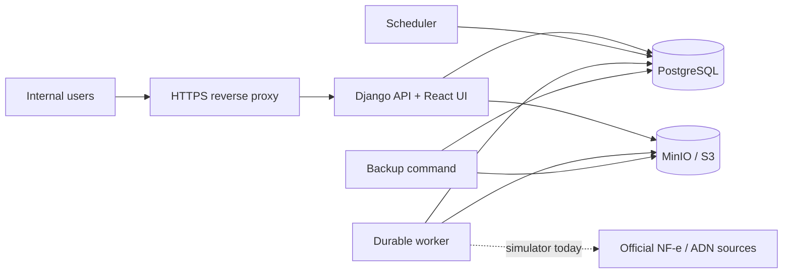

# NFX INOV

NFX INOV is an internal web application for **INOV Contabilidade** to manage companies and A1 certificates, collect and preserve Brazilian electronic fiscal documents, and make the resulting archive searchable, exportable, auditable, and operable.

The system is designed for an initial scale of roughly 200 companies. It favors fiscal integrity, recoverability, traceability, and explicit operational states over maximum collection throughput. The user interface is in Brazilian Portuguese and reports dates in the Brasília time zone and monetary values in BRL.

> **MVP status:** the domain flows, simulator-backed adapters, document archive, UI, asynchronous processing, PDF rendering, ZIP exports, retention, controlled deletion, and local backup validation are implemented. Real NF-e/SEFAZ and NFS-e/ADN transports are deliberately not connected yet; their official endpoints, envelopes, limits, and homologation decisions remain external blockers. A physically separate production backup is also still required before pilot/production approval.

## What it does

- Authenticates internal users and authorizes every server-side action by role.
- Manages companies, their NF-e/NFS-e collection flows, and encrypted A1 `.pfx` certificates.
- Runs durable, resumable jobs for collection, follow-up, PDF rendering, exports, and controlled deletion.
- Preserves original fiscal material in S3-compatible object storage with hashes and explicit conflict/quarantine states.
- Organizes and searches NF-e and NFS-e documents; supports authorized original/XML downloads and derived DANFE/DANFSe PDFs.
- Builds auditable, asynchronous ZIP exports with owner-based download controls and expiration.
- Provides operational dashboard, worker/scheduler freshness, backup status, append-only audit events, retention eligibility, and administrator-only deletion recovery.

The MVP is an internal system. It is not a public API, client portal, SaaS, mobile app, accounting-system integration, legacy-data migration tool, or manual XML-upload service.

## Architecture



It is a modular monolith: web, worker, and scheduler are separate processes built from the same application image and share the domain model, PostgreSQL, and MinIO. This keeps slow work off request handling while avoiding premature distributed-service complexity.

| Component | Responsibility |
|---|---|
| Django web process | Serves the built React application, JSON API, authentication, authorization, and health endpoints. |
| React + Vite frontend | Portuguese application shell and feature-owned screens; `App.tsx` is the composition root. |
| PostgreSQL 16 | Durable domain state: users, sessions, companies, certificates metadata, jobs, documents, audits, exports, backups, and retention operations. |
| MinIO | Private S3-compatible storage for original and derived artifacts. |
| Worker | Claims leased jobs and runs collection-related handlers, ZIP creation, PDF rendering, and deletion steps. |
| Scheduler | Recovers expired work and processes scheduled/initial collection requests. |
| Nginx runtime proxy | Terminates HTTPS and exposes only the application in the runtime deployment. |

### Domain modules

The backend is organized under `backend/nfx/` by domain:

- `identity` — sessions, password handling, users, roles, and server-side policy enforcement.
- `companies` and `certificates` — company lifecycle, flow settings, A1 validation, and envelope encryption.
- `collection` and `adapters` — durable collection execution, policies, cursors, simulated fiscal adapters, NF-e follow-up/manifestation, and ADN coverage.
- `documents` and `artifacts` — fiscal identity, ingestion, immutable originals, integrity, downloads, and derived PDF rendering.
- `jobs` — persistent queue, leases, retry policy, heartbeats, and observability.
- `exports` — asynchronous, owner-scoped ZIP generation and cleanup.
- `retention` — eligibility preview plus an explicit, resumable controlled-deletion saga.
- `audit`, `backup`, and `operations` — append-only audit, verified backup metadata/validation, health, and dashboard aggregation.
- `infrastructure` — validated fail-closed configuration, dependency checks, safe HTTP/logging, redaction, and schema control.

The frontend lives in `frontend/src/` and follows `App → features → shared`. Each business feature owns its screen, API contract, types, and local state. Shared HTTP handling (`shared/http.ts`) centralizes same-origin credentials, CSRF, serialization, and safe errors; `shared/ui/` contains dependency-free visual primitives and tokens. There is intentionally no router, global state library, or UI framework.

## Roles

| Role | Main capabilities |
|---|---|
| Administrator (`administrador`) | All operational capabilities, user administration, audit access, retention/deletion, backup status, and technical health. |
| Operator (`operador`) | Companies, certificates, flow controls, manual/retry collection, documents, individual downloads, and own ZIP exports. |
| Viewer (`visualizador`) | Documents, individual downloads, and permitted own ZIP exports. |

All authenticated users can see registered companies in the MVP; access is constrained by action and role, not by a company portfolio. Authorization is always enforced by the backend, including downloads and asynchronous work.

## Technology stack

- Python 3.12, Django 5.1, Django REST Framework, and `psycopg`.
- PostgreSQL 16 and MinIO (S3 API).
- React 18, TypeScript, Vite 5, and plain CSS design tokens/primitives.
- BrazilFiscalReport 1.0.1 for in-process DANFE/DANFSe PDF generation.
- Docker Compose, Nginx, pytest, Ruff, mypy, ESLint, Playwright, and Graphify.

## Repository layout

```text
backend/nfx/              Django project and modular domain code
frontend/                 Vite/React application and browser-contract tests
tests/unit/               Fast unit and contract tests
tests/integration/        PostgreSQL + MinIO integration tests
scripts/                  Reproducible integration, smoke, hardening, and TLS helpers
docs/                     Development, runtime, operations, export, and hardening runbooks
specs/                    Approved implementation specifications and completion status
deploy/nginx/             Runtime proxy configuration
docker-compose.yml        Local development dependencies and dev-agent
docker-compose.app.yml    Development web/worker/scheduler overlay
docker-compose.test.yml   Isolated test stack
docker-compose.runtime.yml Internal HTTPS runtime deployment
```

## Prerequisites

For local development without containers, install:

- Python **3.12**
- Node.js **20 or 22**
- Docker Engine with Docker Compose v2 (required for integration, browser, smoke, and containerized development)

For the default local setup, Docker also provides PostgreSQL and MinIO. Do not use production fiscal credentials, customer CNPJs, certificates, XMLs, or endpoints in automated tests; the project uses synthetic fixtures and simulator transports.

## Quick start: local development

1. Create a private environment file and replace every placeholder.

   ```sh
   cp .env.example .env
   ```

   At minimum, provide strong values for `NFX_SECRET_KEY`, `NFX_CERTIFICATE_MASTER_KEY`, `POSTGRES_PASSWORD`, and `MINIO_ROOT_PASSWORD`. The certificate master key must be URL-safe base64 encoding of exactly 32 bytes. Keep `.env` out of version control.

2. Install application and frontend dependencies.

   ```sh
   make install
   ```

3. Start PostgreSQL, MinIO, and the development application processes.

   ```sh
   docker compose -f docker-compose.yml -f docker-compose.app.yml up -d --build
   ```

4. Apply migrations under the project’s PostgreSQL advisory lock.

   ```sh
   docker compose -f docker-compose.yml -f docker-compose.app.yml exec web \
     python backend/manage.py nfx_migrate
   ```

5. Bootstrap the initial administrator in a one-off process. Supply `NFX_BOOTSTRAP_ADMIN_PASSWORD` only through a secure environment/secret mechanism; never commit or place it in `.env`.

   ```sh
   docker compose -f docker-compose.yml -f docker-compose.app.yml run --rm \
     -e NFX_BOOTSTRAP_ADMIN_PASSWORD web python backend/manage.py bootstrap_admin
   ```

6. Open `http://127.0.0.1:8001`. The Django server serves the built React application at `/`; it does not require a separate frontend server.

Check readiness at `http://127.0.0.1:8001/health/ready`. MinIO's development console is bound to the loopback interface on the port in `MINIO_CONSOLE_HOST_PORT` (default `9011`); it is infrastructure administration, not a product UI.

### Running processes directly

After dependencies are reachable and your environment is configured, these targets run individual local processes:

```sh
make web
make worker
make scheduler
make check-services
make nfx-migrate
make schema-status
```

For frontend-only work, use `npm --prefix frontend run dev`; the production build is served by Django after `npm --prefix frontend run build`.

## Configuration and secrets

`.env.example` documents the normal development settings. Configuration is validated before any process starts and fails closed for invalid, missing, placeholder, duplicate, or unknown `NFX_*` settings.

| Setting | Purpose |
|---|---|
| `NFX_PROFILE` | `development`, `test`, `homologation`, or `runtime`. |
| `NFX_SECRET_KEY` / `NFX_SECRET_KEY_FILE` | Django secret; use exactly one source. |
| `NFX_CERTIFICATE_MASTER_KEY` / `_FILE` | URL-safe base64 32-byte key that protects certificate material; use exactly one source. |
| `DATABASE_URL` | PostgreSQL URL; PostgreSQL is mandatory. |
| `MINIO_ENDPOINT`, `MINIO_ROOT_USER`, `MINIO_ROOT_PASSWORD`, `MINIO_BUCKET` | Object-storage connection and private bucket. |
| `NFX_ALLOWED_HOSTS` | Comma-separated allowed hostnames. |
| `NFX_FISCAL_TRANSPORT`, `NFX_FISCAL_DESTINATION`, `NFX_FISCAL_ALLOWLIST` | Explicit fiscal transport/destination policy. Local profiles only accept the empty simulator. |
| `NFX_BACKUP_ROOT` | Absolute protected backup root; defaults to `/var/backups/nfx`. |
| Heartbeat/backlog limits | `NFX_WORKER_HEARTBEAT_TIMEOUT_SECONDS`, `NFX_SCHEDULER_HEARTBEAT_TIMEOUT_SECONDS`, and `NFX_JOB_BACKLOG_DELAY_SECONDS`, each 1–86400 seconds. |

Production uses read-only secret files mounted at `/run/secrets` rather than environment values. Never log, commit, return in an API response, or place a certificate password, master key, session secret, or production connection string in a command line.

## Tests and quality checks

| Command | What it verifies |
|---|---|
| `make build` | Backend configuration check plus TypeScript/Vite production build. |
| `make lint` | Ruff, strict mypy with Django stubs, and frontend TypeScript/ESLint. |
| `make test-unit` | Unit and contract tests with synthetic test configuration. |
| `make test-integration` | Isolated PostgreSQL/MinIO integration suite. |
| `make test-browser` | Playwright UI fixtures in Chrome, Firefox, and Edge. |
| `make smoke` | Containerized runtime smoke test, including served frontend assets and web/worker/scheduler health. |
| `make validate` | Build, lint, unit tests, integration tests, and smoke test. |

Run the UI contract directly with `npm --prefix frontend run test:ui-contract`. Browser validation uses synthetic fixtures at desktop/notebook widths (1024, 1280, and 1440 px) and rejects live network calls.

## API and health endpoints

The API is same-origin and intended for the bundled frontend. It is not a public integration contract. All mutation endpoints require a valid authenticated session and CSRF protection; permissions are checked on the server.

| Area | Main endpoints |
|---|---|
| Health | `GET /health/live`, `GET /health/ready`, administrator-only `GET /health/operational` |
| Session | `/api/auth/csrf`, `/api/auth/login`, `/api/auth/logout`, `/api/auth/session` |
| Administration | `/api/users*`, `/api/audit/events`, `/api/backups`, `/api/backups/status` |
| Companies & certificates | `/api/companies*`, `/api/certificates/inventory`, `/api/companies/<id>/certificate*` |
| Collections | `/api/collections`, `/api/collections/executions`, `/api/companies/<id>/collection*` |
| Documents | `/api/documents*`, artifact/original downloads, and PDF render/download endpoints |
| Exports | `/api/exports*` including detail, download, and cleanup |
| Retention | `/api/retention/documents*` and deletion-status/resume endpoints |
| Dashboard | `GET /api/dashboard` and `GET /api/jobs/observability` |

`/health/live` is independent of dependencies. `/health/ready` verifies PostgreSQL/schema and MinIO. Operational health is a safe, redacted administrator view of durable queue and process information; it never exposes fiscal payloads, credentials, certificate material, raw errors, or object keys.

## Operational workflows

### Durable jobs and collection

Jobs have persistent state, idempotency controls, leases, retry policy, and heartbeats. A worker claims work; the scheduler recovers expired leases and handles initial collection requests. Process restarts leave work recoverable instead of silently losing it. NF-e and NFS-e are modeled with independent flows, cursors, source states, and coverage.

The configured local transport is intentionally `simulator://empty`. Do not interpret an empty simulator response as production fiscal coverage. Real official transport activation requires an approved implementation and homologation decision.

### Documents, PDFs, and ZIPs

Original fiscal content remains the authoritative artifact. PDFs are derived, versioned artifacts; a failed rendering must not hide or replace the original. ZIP exports run asynchronously, are scoped to their requester (or an administrator), state partial/failure explicitly, and expire after 24 hours without deleting source documents.

### Retention and controlled deletion

Retention is calculated on demand and does not delete anything automatically. Administrators must preview the current scope, provide the exact explicit confirmation plus a reason, and monitor the durable deletion operation. A failed or interrupted deletion becomes recovery work; do not delete artifacts manually or use generic cleanup tools to force it through.

### Backup validation

Create a verified local backup on an authorized host:

```sh
python backend/manage.py backup --kind daily --idempotency-key daily:YYYY-MM-DD
```

Validate a backup only into an explicit, isolated location outside live runtime/volumes:

```sh
python backend/manage.py restore_backup BACKUP_ID \
  --target-root /var/lib/nfx/restore/isolated-YYYY-MM-DD \
  --runtime-root /var/lib/nfx/runtime
```

This validates the backup set; it does not perform a full disaster restore. The master key is never included in a backup. The MVP's same-host backup directory is insufficient for loss of the host or ransomware—maintain a separately protected physical/off-host copy before production use.

## Internal HTTPS runtime deployment

The runtime stack in `docker-compose.runtime.yml` runs a private PostgreSQL/MinIO data network, isolated application network, and a public reverse proxy. Only the proxy publishes ports (defaults: loopback `8080` HTTP redirect and `8443` HTTPS). Web, worker, and scheduler use the same immutable application image and read-only filesystems with bounded resources.

1. Build/version the app image and prepare external TLS material.

   ```sh
   docker build --target app -t nfx-inov:VERSION .
   docker compose -f docker-compose.runtime.yml build proxy
   scripts/generate-runtime-certificate.sh /var/lib/nfx/tls
   ```

2. Provision `NFX_APP_IMAGE`, `NFX_TLS_DIR`, `NFX_SECRET_DIR`, `NFX_BACKUP_DIR`, `DATABASE_URL`, `POSTGRES_PASSWORD`, `MINIO_ROOT_USER`, and `MINIO_ROOT_PASSWORD` outside version control. `NFX_SECRET_DIR` must contain only `nfx_secret_key` and `nfx_certificate_master_key`, mounted read-only.

3. Bring up state services, migrate, bootstrap the administrator once, then start the complete stack.

   ```sh
   docker compose -f docker-compose.runtime.yml config
   docker compose -f docker-compose.runtime.yml up -d postgres minio
   docker compose -f docker-compose.runtime.yml run --rm web python backend/manage.py nfx_migrate
   docker compose -f docker-compose.runtime.yml run --rm -e NFX_BOOTSTRAP_ADMIN_PASSWORD web python backend/manage.py bootstrap_admin
   docker compose -f docker-compose.runtime.yml up -d
   docker compose -f docker-compose.runtime.yml ps
   ```

Use `https://nfx.internal:8443` or your configured internal hostname. The default certificate is self-signed, so browsers require a trust decision. Restart individual processes with `docker compose -f docker-compose.runtime.yml restart web|worker|scheduler`.

**Never run `docker compose down --volumes` against the runtime stack.** It destroys persistent database and object-store volumes. Before upgrade, take and validate a backup, verify migration compatibility, deploy the new immutable image, wait for readiness, and only roll back while the schema remains compatible.

## Security and integrity model

- Passwords use Argon2id; sessions use secure, same-site cookies and expire after inactivity.
- Certificate files and passwords are encrypted at rest with an external master key.
- Audit records are append-only; normal users—including administrators—cannot edit or delete them.
- Original payloads are hashed and stored before collection progress advances. Conflicts, malformed content, unknown formats, partial processing, and quarantine are explicit states rather than silent overwrites.
- The object bucket is private. Paths, raw provider errors, stack traces, XML, secrets, and object keys are redacted from safe responses and operations views.
- Runtime HTTPS is mandatory even on the internal network. Network placement is a defense-in-depth boundary, not authorization.

## Documentation and delivery status

- [PRD.md](PRD.md) defines product behavior, roles, business rules, and scope.
- [ARCHITECTURE.md](ARCHITECTURE.md) defines technical boundaries, invariants, and deployment direction.
- [docs/DEVELOPMENT.md](docs/DEVELOPMENT.md) explains frontend boundaries and feature contracts.
- [docs/OPERATIONS.md](docs/OPERATIONS.md) documents health, dashboard, backup, rendering, retention, and deletion operations.
- [docs/RUNTIME.md](docs/RUNTIME.md) is the internal HTTPS runtime runbook.
- [docs/EXPORTS.md](docs/EXPORTS.md) describes asynchronous ZIP export behavior.
- [specs/README.md](specs/README.md) is the implementation-spec index and status source.

The major remaining gates are real official NF-e/NFS-e transport decisions and homologation, the unfinished dashboard-capability work where sources/disks remain unavailable, an off-host/physically separate backup, and the internal pilot/homologation evidence. See `specs/README.md` for the authoritative per-spec status and residual-risk record.

## Contributing

Treat `PRD.md`, `ARCHITECTURE.md`, and the applicable file in `specs/` as contracts. Do not change endpoints, RBAC, business rules, state semantics, URLs/anchors, or module boundaries without an approved specification/issue. Keep frontend dependencies flowing from `App` to features to shared code; preserve server-authoritative authorization and explicit durable states.

Before submitting changes, run the relevant quality checks—at least `make lint`, targeted tests, and `make build`; use browser validation for interaction/layout changes and integration tests for persistence, storage, or API behavior.

